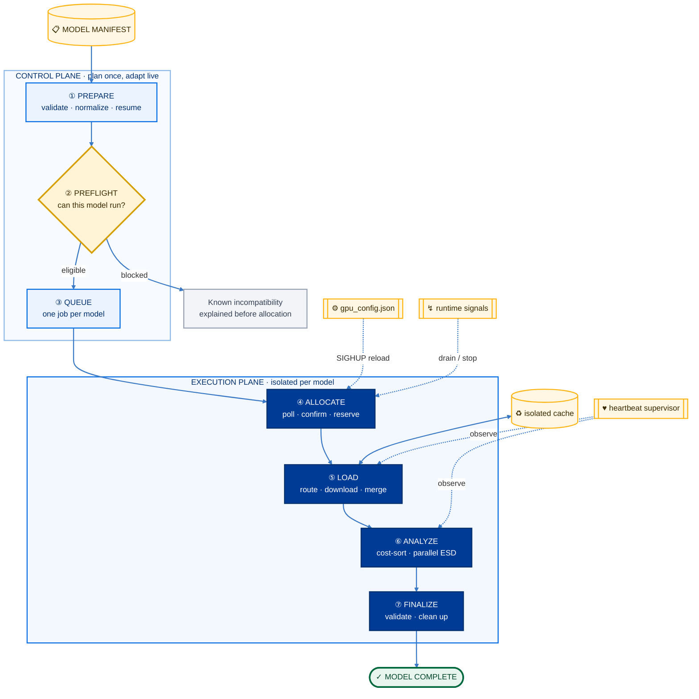
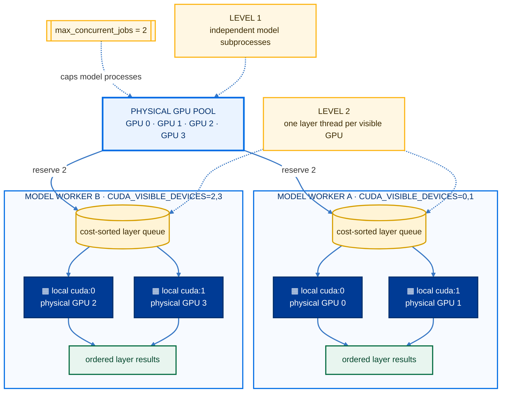
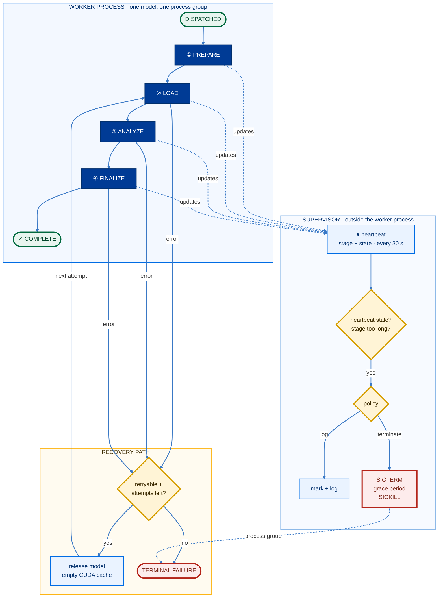
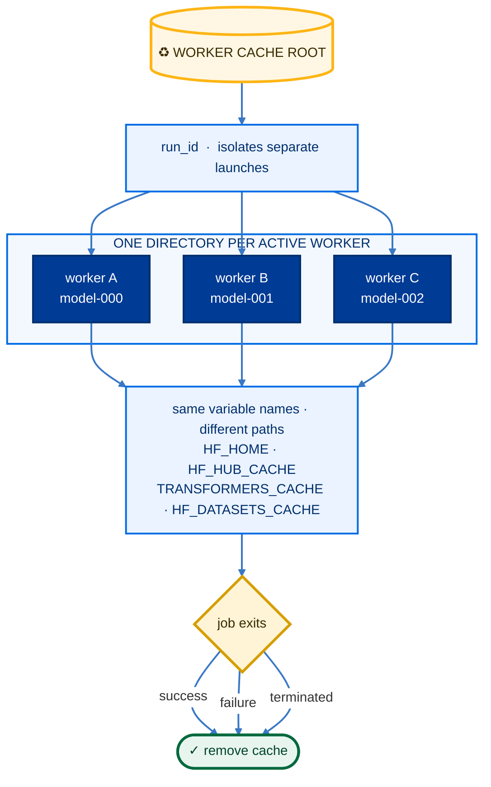
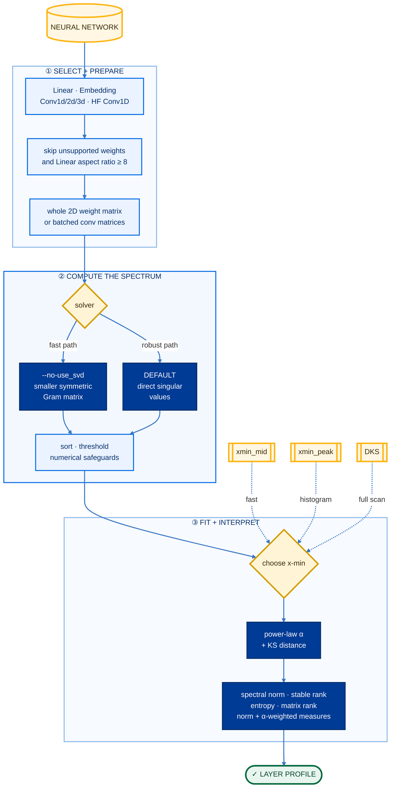

<p align="center">
  
</p>

<h1 align="center">Model-Zoo</h1>

<p align="center">
  <strong>GPU-aware orchestration for large-scale neural-network spectral analysis</strong>
</p>

<p align="center">
  Turn a list of Hugging Face models into isolated, supervised ESD jobs—without manually assigning GPUs, babysitting workers, or cleaning caches.
</p>

<p align="center">
  
  
  
  
</p>

---

## At a glance

| 🎯 GPU-aware dispatch | ⚡ Two-level parallelism | 🛡️ Supervised workers |
| :--- | :--- | :--- |
| Waits for genuinely free GPUs and reserves them per model. | Runs models concurrently, then distributes layers within each model. | Tracks heartbeats, stages, PIDs, process groups, and failures. |
| **♻️ Ephemeral caches** | **🧩 Format-aware loading** | **🎛️ Live control** |
| Isolates every worker cache and removes it after the job. | Routes standard, adapter, multimodal, and quantized repositories. | Reloads GPUs and limits at runtime; supports drain and hard stop. |

## Start in three steps

### 1 · Create the environment

```bash
git clone https://github.com/RpM-Kinshuk/Model-Zoo.git
cd Model-Zoo
conda env create -f environment.yml
conda activate esd_ind
```

For gated or private repositories:

```bash
export HF_TOKEN="<your-token>"
```

### 2 · List the models

The smallest input CSV for preparation has one column:

```csv
model_id
openai-community/gpt2
google/flan-t5-small
```

Adapters can name their base explicitly:

```csv
model_id,base_model_relation,source_model
org/my-lora,adapter,org/base-model
```

Model revisions work as `org/model@revision` or through the optional `revision_norm` column. Curated tables may also carry loader, architecture, file, pipeline, and hub-availability hints for better preflight decisions.

### 3 · Pin, review, run

```bash
python esd_experiment/run_experiment.py \
  --model_list models.csv \
  --output_dir analysis_runs/my_run --limit 5 --prepare_only
```

Preparation fetches metadata and adapter config JSON, not weights. Review the
generated `models.csv`; fix or remove rows marked `pin_status=error`, then launch:

```bash
python esd_experiment/run_experiment.py \
  --model_list analysis_runs/my_run/models.csv \
  --output_dir analysis_runs/my_run \
  --gpus 0 1 2 3 \
  --num_gpus_per_job 1 \
  --max_concurrent_jobs 3
```

The prepared list pins full model and adapter-base commit SHAs. Keep it for
resume; preparation never overwrites it. Remote code is off by default—only use
`--trust_remote_code` for repositories you reviewed. For the curated workflow,
prepare from `data/curated/model_zoo_phase2.csv`; see the [analysis guide](docs/operations/analysis.md).

> [!TIP]
> `run_script.sh` is the HPC-oriented launch template. Adapt its paths, GPU list, and scheduler policy for your cluster.

## The system, visually



<p align="center"><sub>Gold = inputs & controls&nbsp;&nbsp;·&nbsp;&nbsp;Light blue = orchestration&nbsp;&nbsp;·&nbsp;&nbsp;Navy = GPU execution&nbsp;&nbsp;·&nbsp;&nbsp;Green = successful completion</sub></p>

| Component | Owns |
| --- | --- |
| `run_experiment.py` | Input normalization, resume filtering, preflight, job creation |
| `gputracker/` | GPU polling, reservations, concurrency, signals, supervision |
| `worker.py` | One model's load → analyze → finalize lifecycle |
| `model_loader.py` | Hugging Face class selection, revisions, adapters, format fallbacks |
| `net_esd/` | Layer selection, GPU work queue, spectral computation |

## Two levels of parallelism



### Level 1 · models across GPUs

The dispatcher considers a physical GPU free when:

```text
used memory < --gpu_memory_threshold
AND it is not reserved by this run
AND it passes --max_check consecutive polls
```

It atomically reserves `--num_gpus_per_job` devices, exposes only those devices through `CUDA_VISIBLE_DEVICES`, and releases them in a `finally` block on every exit path.

`--max_concurrent_jobs` adds a separate cap for host RAM, network, filesystem, or API-rate constraints. Without it, free GPUs determine concurrency.

> [!NOTE]
> GPU IDs on the CLI are physical IDs. CUDA remaps them inside a worker: a worker assigned physical GPU 6 will usually see it as local `cuda:0`.

### Level 2 · layers across each worker's GPUs

`net_esd` estimates per-layer compute cost, schedules the largest layers first, and feeds them to one fixed-device thread per visible GPU. A shared queue keeps faster GPUs busy while result ordering remains deterministic.

```bash
# Two concurrent models, two GPUs available to each model
python esd_experiment/run_experiment.py \
  --model_list analysis_runs/my_run/models.csv \
  --output_dir analysis_runs/my_run \
  --gpus 0 1 2 3 \
  --num_gpus_per_job 2 \
  --max_concurrent_jobs 2
```

The library API also offers a spawned-process backend. Batch workers use the thread backend, avoiding per-layer tensor serialization.

## A worker's lifecycle



One dispatch thread walks the queue. Each active model gets a lightweight controller thread, a separate subprocess, and its own Unix process group. This isolates model-specific crashes and gives the supervisor a precise termination boundary.

### Retries and resume

| Mechanism | What it handles |
| --- | --- |
| Loader fallback | Meta-tensor reload, corrected model-class routing, spectral-only `AutoModel` fallback |
| Worker retry | CUDA OOM, load errors, analysis exceptions, finalization errors |
| Terminal failure | Unsupported formats, unresolved adapter bases, gated/missing repos, empty analysis |
| Resume | Skips complete work; clears and regenerates partial work |

> [!IMPORTANT]
> The direct worker supports `--max_retries` and defaults to zero. The batch runner does not currently forward a whole-job retry count, so batch jobs make one attempt while still using loader-level corrective fallbacks. On the next batch run, failures are retried unless `--skip_failed` is set.

Use `--overwrite` to regenerate all selected models, or `--skip_failed` to move past the recorded failure set.

## Smart model loading

Preflight probes optional backends in GPU-hidden child processes, preventing imports from polluting scheduler CUDA state. Eligible jobs then follow the most specific known route.

| Route | Behavior |
| --- | --- |
| Causal / seq2seq / classification | Selects the matching Transformers auto class |
| Multimodal | Uses the image-text auto model path when metadata indicates it |
| PEFT / LoRA | Resolves the base, loads both, then merges and unloads the adapter |
| GPTQ | Applies compatibility handling and loads when the backend is healthy |
| GGUF | Resolves a repository GGUF file for the Transformers loader |
| Compressed tensors | Runs only when its optional backend imports successfully |
| Alternate quantization | Rejects EXL2 explicitly; reports unsupported merge paths clearly |

If an adapter's base cannot be inferred confidently, add `source_model` to the CSV. Explicit metadata wins over guesswork.

## Cache: isolated by design



Every job gets `<worker_cache_root>/<run_id>/<worker_id>/`. Isolation prevents partial-download collisions; automatic removal prevents long runs from filling scratch storage.

```bash
--worker_cache_root /scratch/$USER/model_zoo_worker_cache
```

The default is `MODEL_ZOO_WORKER_CACHE_ROOT` or `/scratch/kinshuk/hf_worker_cache`. Pass an empty value to inherit a shared Hugging Face cache instead.

## Live controls

At startup, scheduler options become `<output_dir>/gpu_config.json`. Edit the file, then reload it without interrupting active workers:

```bash
kill -HUP <runner-pid>
```

```json
{
  "available_gpus": [0, 1, 2, 3],
  "max_checks": 5,
  "memory_threshold_mb": 500,
  "max_concurrent_jobs": 2,
  "stale_process_action": "log",
  "heartbeat_timeout_seconds": 3600,
  "stage_timeout_seconds": {
    "load": 7200,
    "analyze": 28800,
    "save": 1800,
    "default": 14400
  },
  "termination_grace_seconds": 30
}
```

| Signal | Effect |
| --- | --- |
| 🔄 `SIGHUP` | Reload GPU pool, concurrency, and timeout policy |
| 🟡 `SIGUSR1` | Drain: stop dispatching, let active workers finish |
| 🔴 `SIGINT` / `SIGTERM` | Hard stop all active worker process groups |

Removing a GPU from the live pool affects future jobs; it does not evict a worker already using that GPU.

### Stale-worker policy

Two clocks catch different failure modes:

```text
heartbeat timeout  → the heartbeat writer stopped
stage timeout      → heartbeat is alive, but load/analyze/save is stuck
```

Start with `stale_process_action: "log"` while tuning. Once the limits fit your model sizes, switch to `"terminate"`; stale process groups receive `SIGTERM`, a grace period, then `SIGKILL` if required.

## ESD in one picture



The estimator avoids copying the model, skips linear matrices with aspect ratio ≥ 8, batches convolution kernels, and uses pinned host memory for CPU→GPU transfers. The Gram path symmetrizes its matrix, retries with diagonal jitter, then falls back to SVD if eigendecomposition remains unstable.

### Tune the analysis

| Option | Default | Choice |
| --- | ---: | --- |
| `--fix_fingers` | `xmin_mid` | `xmin_mid` · `xmin_peak` · `DKS` |
| `--evals_thresh` | `1e-5` | Absolute cutoff for fitting and retained metrics; saved spectra stay full |
| `--bins` | `100` | Histogram resolution for `xmin_peak` |
| `--use_svd` | on | Direct SVD; `--no-use_svd` selects Gram eigenvalues |
| `--save_eigs` | on | Save full spectra; `--no-save_eigs` stores scalars only |
| `--filter_zeros` | on | Retain values strictly above the threshold |
| `--parallel_esd` | on | Distribute layers across visible GPUs |

`xmin_mid` is fastest. `xmin_peak` focuses cutoff candidates near the histogram peak. `DKS` scans valid cutoffs and minimizes the Kolmogorov–Smirnov distance.

## Scheduler cheat sheet

| Goal | Use |
| --- | --- |
| Choose physical devices | `--gpus 0 1 2 3` |
| Reserve N GPUs per model | `--num_gpus_per_job N` |
| Limit active models | `--max_concurrent_jobs N` |
| Require nearly empty GPUs | `--gpu_memory_threshold 500` |
| Confirm a GPU stays free | `--max_check 5` |
| Change timeout behavior | `--stale_process_action log\|terminate` |
| Resume but ignore old failures | `--skip_failed` |
| Recompute selected models | `--overwrite` |

```bash
python esd_experiment/run_experiment.py --help
```

## Observe a live run

```bash
watch -n 5 'python -m json.tool analysis_runs/my_run/logs/current_state.json'
```

The live snapshot surfaces the runner, active workers, current stages, physical GPUs, PIDs, process groups, heartbeat data, log paths, and cache paths. The scheduler log is `logs/esd_experiment.log`; per-worker active metadata and logs are cleaned after each job, while terminal diagnostics remain available for post-mortem debugging.

<details>
<summary><strong>Nothing is starting</strong></summary>

- Check `gpustat` or `nvidia-smi`; selected GPUs may exceed the threshold.
- Confirm every ID passed to `--gpus` exists on the node.
- Reduce `--max_check` for a faster allocation decision.
- Read the scheduler log for preflight blocks or already-complete rows.

</details>

<details>
<summary><strong>A worker is alive but stuck</strong></summary>

Inspect its stage and log path in `current_state.json`. Keep the stale action at `log` while calibrating; switch it to `terminate` and send `SIGHUP` once the timeout windows are trustworthy.

</details>

<details>
<summary><strong>CUDA out of memory</strong></summary>

- Give `device_map=auto` more GPUs per job when a model needs sharding.
- Reduce concurrent jobs when simultaneous loads exhaust host resources.
- Lower the memory threshold to make allocation more conservative.
- Use the worker log to distinguish loading OOM from layer-analysis OOM.

</details>

<details>
<summary><strong>Private model or unresolved adapter</strong></summary>

Export an authorized `HF_TOKEN` for private/gated repositories. For adapters, add `source_model` explicitly when hub metadata is incomplete.

</details>

## Code map

```text
esd_experiment/
├── run_experiment.py          public entrypoint
├── src/
│   ├── run_experiment.py      preflight, resume, jobs
│   ├── model_preflight.py     eligibility + routing
│   ├── worker.py              single-model lifecycle
│   └── model_loader.py        Hugging Face loading
├── gputracker/
│   ├── gputracker.py          dispatch + supervision
│   └── supervision.py         live state + cache cleanup
└── tests/

net_esd/
├── __init__.py                estimator + layer scheduler
├── core.py                    spectral computation
└── utils.py                   layer filtering + cost model
```

## Verify the installation

```bash
python -m pytest esd_experiment/tests -q \
  --ignore=esd_experiment/tests/test_setup.py \
  --ignore=esd_experiment/tests/test_gpu.py
python esd_experiment/tests/test_setup.py
python esd_experiment/tests/test_gpu.py
```

## Read next

| Guide | Best for |
| --- | --- |
| [Experiment runner](esd_experiment/README.md) | Quick start and code map |
| [Analysis guide](docs/operations/analysis.md) | Measurements, storage, resume and GPU supervision |
| [Operations](docs/operations/README.md) | End-to-end workflow context |

---

<p align="center">
  Built for experiments that should keep moving—even when individual models do not.
  <br><br>
  <a href="LICENSE">License</a>
</p>
