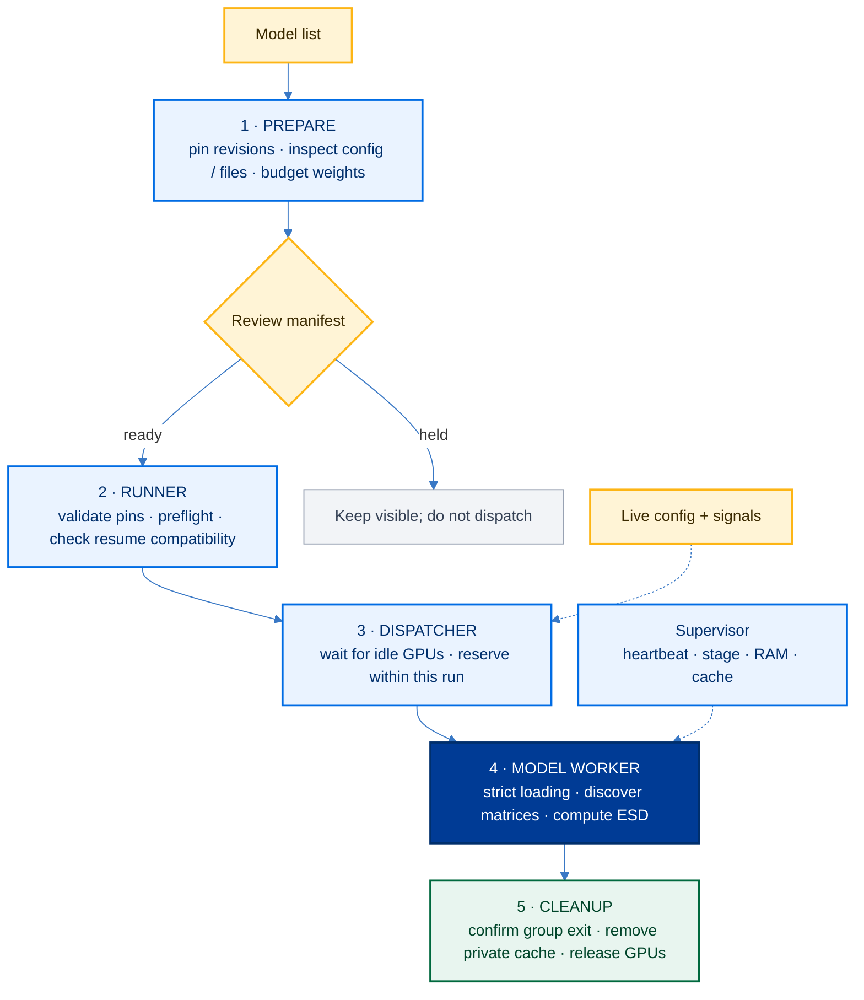
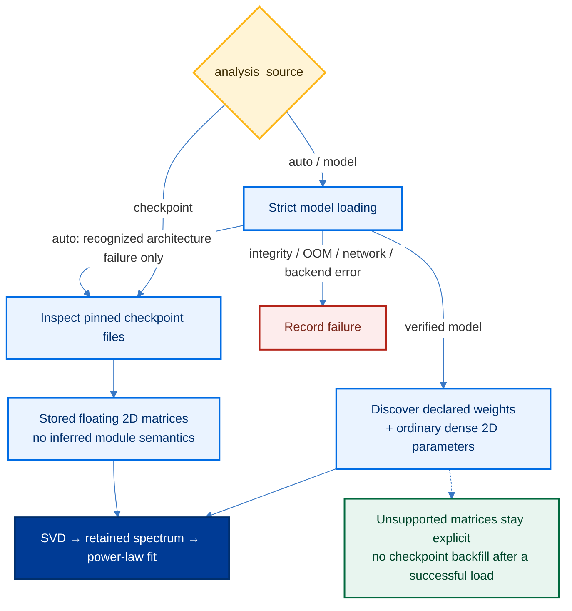

# Model-Zoo

**From checkpoint weights to spectral structure.**

GPU orchestration and empirical spectral analysis for Hugging Face models.
Prepare a pinned model list; the runner coordinates allocation, isolated
workers, matrix analysis and cleanup.

[Start a run](#start-a-run) · [GPU scheduling](#gpu-allocation-and-parallelism) ·
[Runtime controls](#runtime-controls-and-cache-lifecycle) · [ESD](#measurement-scope) ·
[Reference](docs/operations/analysis.md)

## How the code fits together

<picture>
  <source media="(prefers-reduced-motion: reduce)" srcset="docs/assets/run-atlas.svg">
  
</picture>

<p align="center"><sub>Illustrative concurrent run. <a href="docs/assets/run-atlas.svg">Open the static atlas</a>.</sub></p>

| Pin | Schedule | Measure | Release |
| :--- | :--- | :--- | :--- |
| Exact model and adapter-base revisions | Idle-GPU checks and bounded concurrency | Verified weights, explicit matrix coverage | Confirm exit, clean private cache, return GPUs |

<details>
<summary>Explore the architecture and source map</summary>


```mermaid
%%{init: {"theme":"base","flowchart":{"curve":"basis","nodeSpacing":26,"rankSpacing":36},"themeVariables":{"fontFamily":"ui-sans-serif, system-ui","fontSize":"15px","lineColor":"#3978C5","edgeLabelBackground":"#FFFFFF"}}}%%
flowchart TB
    INPUT["Model list"] --> PREP["1 · PREPARE<br/>pin revisions · inspect config / files · budget weights"]
    PREP --> REVIEW{"Review manifest"}
    REVIEW -->|ready| RUN["2 · RUNNER<br/>validate pins · preflight · check resume compatibility"]
    REVIEW -->|held| HOLD["Keep visible; do not dispatch"]
    RUN --> GPU["3 · DISPATCHER<br/>wait for idle GPUs · reserve within this run"]
    GPU --> WORKER["4 · MODEL WORKER<br/>strict loading · discover matrices · compute ESD"]
    WORKER --> STOP["5 · CLEANUP<br/>confirm group exit · remove private cache · release GPUs"]
    LIVE["Live config + signals"] -.-> GPU
    WATCH["Supervisor<br/>heartbeat · stage · RAM · cache"] -.-> WORKER
    classDef input fill:#FFF4D6,stroke:#FDB515,color:#3B2A00,stroke-width:2px;
    classDef control fill:#EAF3FF,stroke:#006CE4,color:#002F6C,stroke-width:2px;
    classDef execute fill:#003B95,stroke:#002F6C,color:#FFFFFF,stroke-width:2px;
    classDef done fill:#E8F5EF,stroke:#00693E,color:#00452A,stroke-width:2px;
    classDef held fill:#F2F4F7,stroke:#98A2B3,color:#344054;
    class INPUT,REVIEW,LIVE input;
    class PREP,RUN,GPU,WATCH control;
    class WORKER execute;
    class STOP done;
    class HOLD held;
```

| Code | Owns |
| --- | --- |
| `esd_experiment/src/run_experiment.py` | Preparation, metadata pins, preflight, resume and worker jobs |
| `esd_experiment/gputracker/` | GPU allocation, live config, process groups, resource checks and cleanup |
| `esd_experiment/src/worker.py` | One model's load → analyze → finalize lifecycle and heartbeat |
| `esd_experiment/src/model_loader.py` | Architecture selection, checkpoint integrity and validated adapter merging |
| `esd_experiment/src/checkpoint_tensors.py` | Stored-matrix analysis without constructing a model |
| `net_esd/` | Matrix discovery, coverage, layer scheduling and spectral computation |

</details>

## Start a run

**Prepare → review → run → resume.** Begin with a small list and the default
single worker.

<details>
<summary><strong>First run?</strong> Create the environment and input list</summary>

### 1 · Create the environment

```bash
git clone https://github.com/RpM-Kinshuk/Model-Zoo.git
cd Model-Zoo
conda env create -f environment.yml
conda activate model_zoo
python -m pip install torch==2.11.0 torchvision==0.26.0 --index-url https://download.pytorch.org/whl/cu128
python -m pip install -r requirements.txt
python esd_experiment/tests/test_setup.py
```

Use a fresh environment; preserve the shared `esd_ind` installation.
Conda supplies Python; pip installs the directly pinned analysis dependencies.
This is not a full transitive lock. The CUDA pairing follows the
[official PyTorch recipe](https://pytorch.org/get-started/previous-versions/#v2110);
use its `cpu` wheel index for CPU-only work. The setup check is offline and CPU-only.

Create `models.csv`:

```csv
model_id
openai-community/gpt2
google/flan-t5-small
```

For an adapter, supply `base_model_relation=adapter` and preferably
`source_model=org/base-model`. Preparation also accepts `org/model@revision`
or `revision_norm` and resolves them to full commit pins.

Gated/private repositories need an authorized token:

```bash
export HF_TOKEN="<your-token>"
```

Optional quantization backends and the
[clustering dashboard](clustering/unsupervised/README.md) are separate installs.
An importable backend does not guarantee a checkpoint can be measured.

</details>

### 2 · Prepare and review a small list

```bash
python esd_experiment/run_experiment.py \
  --model_list models.csv \
  --output_dir analysis_runs/phase2/my_run --limit 5 --prepare_only
```

Review the generated `models.csv`: **pins · config labels · weight budget ·
ready/held status**. Preparation reads metadata and small JSON files, not weights.

<details>
<summary>Pinning, held rows and curated inputs</summary>

Launch requires full 40-character model and adapter-base commit SHAs.
Ready rows can launch; held rows remain visible and are not dispatched.
Inspect `preparation_status` and `preparation_reason` before starting.

Config labels are trusted for routing only at their recorded revision.
Preparation preserves an existing `models.csv`; resume with it or prepare a
fresh directory for new pins. The default selected-weight budget is 6 GiB,
including adapter bases; `--max_weight_gib 0` disables its size cap.

For larger collections, start from `data/curated/model_zoo_phase2.csv`.
Imported family labels and old ready subsets have known
[limitations](docs/operations/curation.md#architecture-label-caveat);
prefer pinned config evidence over names.

</details>

### 3 · Run, stop and resume

```bash
python esd_experiment/run_experiment.py \
  --model_list analysis_runs/phase2/my_run/models.csv \
  --output_dir analysis_runs/phase2/my_run \
  --gpus 0 1 2 3 --num_gpus_per_job 1 \
  --worker_cache_root /scratch/$USER/model_zoo_worker_cache
```

Relaunch with the same pins and settings to resume completed work.
`run_script.sh` is the site-specific HPC wrapper.

---

## GPU allocation and parallelism


| Choose the pool | Divide each model | Bound simultaneous models |
| --- | --- | --- |
| `--gpus 0 1 2 3` | `--num_gpus_per_job 2` | `--max_concurrent_jobs 2` |

The diagram illustrates two workers; the launch default is **one worker,
one GPU per model**. Allocation requires two consecutive idle checks, five
seconds apart, with no GPU processes and memory below 500 MB.

<details>
<summary>Allocation rules, thread management and a multi-GPU launch</summary>

Physical GPU IDs become local CUDA IDs through `CUDA_VISIBLE_DEVICES`.
The dispatcher reserves devices within this run. Idle checks are cooperative;
another user's job can start afterward.

`--gpu_memory_threshold` changes the used-memory threshold and `--max_check`
changes the number of consecutive checks. Model mode cost-sorts matrices and
uses one fixed-device thread per compute GPU. It prefers visible devices not
hosting the model, otherwise reuses the visible pool. Disable layer parallelism
with `--no-parallel_esd`. The library API also offers a spawned-process backend.

For two simultaneous model workers, each seeing two GPUs:

```bash
python esd_experiment/run_experiment.py \
  --model_list analysis_runs/phase2/my_run/models.csv \
  --output_dir analysis_runs/phase2/my_run \
  --gpus 0 1 2 3 --num_gpus_per_job 2 --max_concurrent_jobs 2 \
  --worker_cache_root /scratch/$USER/model_zoo_worker_cache
```

Model sharding and spectral computation share assigned devices. More visible
GPUs do not guarantee enough analysis memory; review actual costs before
increasing concurrency. Checkpoint mode processes files/matrices sequentially
on one selected device. Explicit `--analysis_source checkpoint` requires
`--num_gpus_per_job 1`.

</details>

## Runtime controls and cache lifecycle


| Reload policy | Finish active work | Stop and clean up |
| --- | --- | --- |
| `SIGHUP` | `SIGUSR1` | `SIGINT` / `SIGTERM` |

**Default bounds:** 6 GiB selected weights · 16 GiB sampled worker RAM ·
12 GiB sampled private cache. The supervisor releases resources after confirming
process-group exit.

<details>
<summary>Live state, resource limits, timeouts and cache ownership</summary>

```bash
watch -n 5 'python -m json.tool analysis_runs/phase2/my_run/logs/current_state.json'
```

The snapshot includes the runner PID, worker state, stages, GPUs, process
groups, heartbeat data and cache/log paths.

| Control | Default |
| --- | --- |
| `--max_weight_gib` | 6 GiB; preparation includes adapter-base weights |
| `--max_worker_ram_gib` | 16 GiB sampled worker-tree RSS |
| `--max_worker_cache_gib` | 12 GiB sampled private-cache usage |
| `--heartbeat_timeout_seconds` | 3600 s without a heartbeat |
| `--stage_timeout_seconds` | `load=7200,analyze=28800,save=1800,default=14400` |
| `--stale_process_action` | `terminate`; `log` marks stale workers and keeps waiting |
| `--termination_grace_seconds` | 30 s after TERM before KILL |

Zero disables a weight/RAM/cache cap, the heartbeat timeout or an individual
stage timeout. The termination grace period must be at least one second.
RAM/cache checks can overshoot between samples and do not predict GPU memory.
Heartbeat age detects a stopped reporter; stage age catches foreground work
that is stuck while its reporter remains alive.

Edit `gpu_config.json` and send `SIGHUP` to reload at a safe point. Invalid
reloads retain the previous settings. Live fields include `available_gpus`,
`max_concurrent_jobs`, `memory_threshold_mb`, `max_checks`, resource limits
and timeout policy. Removing a GPU from the pool does not evict its worker.

Each private cache lives at `<worker_cache_root>/<run_id>/<worker_id>/`.
Hub and legacy Transformers downloads share revision-addressed storage;
dataset, Xet and remote-module caches stay under the same private root.
Cleanup confirms worker-group exit before removing the cache and releasing GPUs.
Unconfirmed termination retains evidence and stops dispatch.

To inherit a shared Hugging Face cache, add both options to the launch command:

```bash
--worker_cache_root "" --max_worker_cache_gib 0
```

Shared caches are neither deleted nor counted against the private-cache limit.
RAM and other supervision remain active.

</details>

<details>
<summary>Resume, failures and retries</summary>

Compatible completed pairs are skipped. Interrupted models restart from the
model boundary, not an individual layer. Resume requires the same manifest,
pins and measurement settings. Incompatible/incomplete outputs require
inspection; use a fresh directory for changed conventions.
`--overwrite` deliberately replaces selected results.

Batch workers make one whole-job attempt. The standalone worker exposes
`--max_retries` (default 0) for classified retryable failures. Loader recovery
and checkpoint fallback are separate mechanisms. Relaunching retries failures
unless `--skip_failed` is set.

Ordinary model failures allow the queue to continue after successful cleanup.
Status, supervision or unconfirmed cleanup failures stop new dispatch and exit
nonzero. Inspect retained diagnostics and owned processes before resuming.
Allow signal-triggered cleanup to finish; avoid killing the runner with SIGKILL.

</details>

## Measurement scope


The default is **SVD · float32 computation · midpoint tail cutoff**.
Declared module weights and ordinary dense 2D parameters are measured;
unsupported representations retain explicit reasons.

<details>
<summary>Which matrices are included?</summary>

| Matrix family | Interpretation |
| --- | --- |
| Linear, Embedding, HF Conv1D | Whole dense matrices, including wide/tall projections |
| Conv1d / Conv2d / Conv3d | Declared kernel slices, not the full convolution operator |
| Built-in MultiheadAttention | Declared fused or separate projections; no synthetic QKV split |
| HF ViT token/position tables | Declared tables with the singleton broadcast axis removed |
| HF Swin relative-position tables | Stored relative-position-by-head matrices, not attention operators |
| Other ordinary dense 2D registered parameters | Exact parameter names, including attributes beyond `.weight` |

Declared weights are visited first; generic discovery does not remeasure their
shared aliases. Unknown higher-dimensional layouts, packed quantization,
adapter factors and parametrization internals are excluded with reasons.

| Candidate | Default | With `--filter_type` |
| --- | --- | --- |
| Ordinary 2D parameter such as `custom.extra` | Included by exact name | Excluded by legacy selection |
| Linear aspect ratio ≥ 8 | Included whole | Skipped by legacy rule |
| Undeclared 3D `custom.kernel` | Skipped with reason | Skipped with reason |
| Packed/quantized storage | No automatic unpacking | No automatic unpacking |

Discovery preserves loaded parameter values. It does not infer a layout from
a name or a 3:1 shape. A stored matrix is a descriptor of that parameter,
not a verified linear operator.

</details>

<details>
<summary>Loading, fallback and retries: the routing diagram</summary>


```mermaid
%%{init: {"theme":"base","flowchart":{"curve":"basis","nodeSpacing":26,"rankSpacing":36},"themeVariables":{"fontFamily":"ui-sans-serif, system-ui","fontSize":"15px","lineColor":"#3978C5","edgeLabelBackground":"#FFFFFF"}}}%%
flowchart TB
    POLICY{"analysis_source"}
    POLICY -->|auto / model| LOAD["Strict model loading"]
    POLICY -->|checkpoint| TENSORS["Inspect pinned checkpoint files"]
    LOAD -->|verified model| MODULES["Discover declared weights<br/>+ ordinary dense 2D parameters"]
    LOAD -->|auto: recognized architecture failure only| TENSORS
    LOAD -->|integrity / OOM / network / backend error| FAIL["Record failure"]
    TENSORS --> STORED["Stored floating 2D matrices<br/>no inferred module semantics"]
    MODULES --> ESD["SVD → retained spectrum → power-law fit"]
    STORED --> ESD
    MODULES -.-> COVERAGE["Unsupported matrices stay explicit<br/>no checkpoint backfill after a successful load"]
    classDef decision fill:#FFF4D6,stroke:#FDB515,color:#3B2A00,stroke-width:2px;
    classDef control fill:#EAF3FF,stroke:#006CE4,color:#002F6C,stroke-width:2px;
    classDef execute fill:#003B95,stroke:#002F6C,color:#FFFFFF,stroke-width:2px;
    classDef failure fill:#FDECEC,stroke:#B42318,color:#7A271A,stroke-width:2px;
    classDef coverage fill:#E8F5EF,stroke:#00693E,color:#00452A,stroke-width:2px;
    class POLICY decision;
    class LOAD,TENSORS,MODULES,STORED control;
    class ESD execute;
    class FAIL failure;
    class COVERAGE coverage;
```

Strict loading checks keys, shapes and architecture compatibility before
analysis. Missing/mismatched trained weights do not become random replacements.
Recognized encoder layouts support architecture recovery; validated supported
LoRA/RSLoRA payloads are safely merged.

`--analysis_source auto` attempts strict model loading, then falls back once
for narrowly recognized architecture-support failures. `model` disables
fallback; `checkpoint` directly measures stored floating 2D matrices.
Safetensors and memory-mappable PyTorch ZIP state dicts with `weights_only=True`
are supported. Checkpoint analysis does not merge adapters, unpack quantized
representations or establish a verified model.

Integrity failures, OOM, network and backend errors do not trigger automatic
fallback. After a successful model load, partial/empty module analysis does
not switch sources or backfill skipped weights. No usable spectra is a failure.
See the [exact fallback rules](docs/operations/analysis.md#architecture-independent-checkpoint-matrices).

Remote code is off by default. `--trust_remote_code` is for reviewed
repositories; same-repo code follows the pin and cross-repo references are
rejected.

</details>

<details>
<summary>Numerical settings, interpretation and compatibility</summary>

| Option | Default |
| --- | --- |
| `--analysis_source` | `auto` |
| `--load_dtype` | `auto`, checkpoint/framework-selected |
| `--compute_dtype` | `float32`; `float64` for reference checks |
| `--use_svd` | On; CUDA uses `gesvd`. `--no-use_svd` selects Gram |
| `--fix_fingers` | `xmin_mid`; alternatives: `xmin_peak`, `DKS` |
| `--filter_zeros` / `--evals_thresh` | On / absolute threshold `1e-5` |

SVD is the default because Gram construction can lose small-eigenvalue
accuracy. Upcasting cannot restore loading precision. Missing fits stay explicit;
a completed run may have partial coverage. A finite alpha or small KS distance
does not establish power-law behavior or generalization.

Current conventions: **numerics 7 · loader 10 · matrix selection 4**.
Selection 4 adds generic parameter matrices without changing formulas. Older
selections remain readable but cannot resume as selection 4; collect expanded
coverage in a fresh directory.

[Coverage and loader rules](docs/operations/analysis.md#loading-and-coverage) ·
[Metric definitions](docs/operations/analysis.md#interpreting-the-metrics)

</details>

---

## Verification and maintenance

```bash
python -m pytest esd_experiment/tests -q
```

<details>
<summary>Installation checks, focused regressions and maintenance notes</summary>

Pytest is a development dependency, not a worker requirement:

```bash
python -m pip install 'pytest>=8,<9'
python esd_experiment/tests/test_setup.py

python -m pytest \
  esd_experiment/tests/test_worker.py \
  esd_experiment/tests/test_checkpoint_tensors.py \
  esd_experiment/tests/test_model_loader.py -q
```

The setup check uses imports and a tiny CPU spectrum without token access,
downloads or GPU use. Regression tests cover matrix selection, numerical edge
cases, integrity, persistence, process ownership and fallback boundaries.
Optional independent SciPy float64 controls are in the
[validation guide](docs/operations/analysis.md#validation); they are separate
from collection and do not establish model quality.

Use `python esd_experiment/run_experiment.py --help` for the complete CLI.
Keep helpers simple and add support for consequential collection failures.
General probes are not a prerequisite for every small change or batch.

The diagrams are editable, self-contained assets. Their
[visual reference](docs/assets/README.md) includes regeneration instructions.

</details>

Collection supports bounded research runs; 50,000-model operation is not yet
proven. Matrix support is not universal architecture support, and spectral
descriptors require separate research validation for model-quality claims.

[Analysis reference](docs/operations/analysis.md) ·
[Runner code map](esd_experiment/README.md#code-map) ·
[Operations](docs/operations/README.md) · [License](LICENSE)
